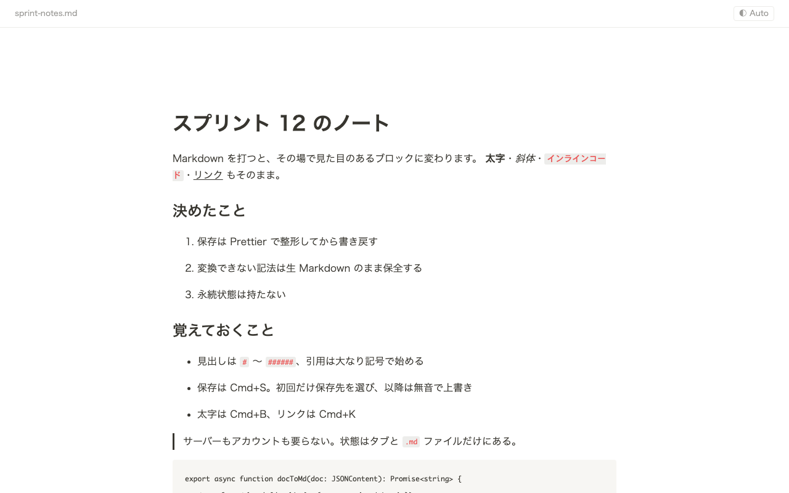

# numenumd

English | [日本語](README.ja.md)

numenumd is a Chrome extension that turns local Markdown files into a
Notion-style WYSIWYG editor. Open a `.md` file from your disk in Chrome and edit
it in place: no server, no account, nothing uploaded. When you save, numenumd
writes cleanly formatted Markdown back to the same file, and anything it can't
display as rich text is kept exactly as you wrote it.



## Install

numenumd is not published on the Chrome Web Store. Install it as an unpacked
extension, either from a release or from source.

### From a release (no Node.js needed)

1. Download `numenumd-vX.Y.Z.zip` from
   [Releases](https://github.com/tomoyahiroe/numenumd/releases) and unzip it.
2. Open `chrome://extensions` and turn on **Developer mode** (top right).
3. Click **Load unpacked** and select the unzipped folder.
4. Open numenumd's **Details** and turn on **Allow access to file URLs**.
5. Open any `.md` file in Chrome (drag it into a tab, or open a `file://` URL).

### From source

Requires Node.js 22 and npm.

```bash
git clone https://github.com/tomoyahiroe/numenumd.git
cd numenumd
npm install
npm run build
```

Then follow steps 2–5 above, selecting the generated `dist/` folder in step 3.

**Why step 4 matters:** numenumd runs on `file://` pages, and Chrome blocks
extensions from them by default. Without **Allow access to file URLs**, your
`.md` file stays as plain text.

## Features

- **Markdown shortcuts as you type**: `# ` to `###### ` for headings, `- `,
  `1. `, `[] ` / `[x] ` for lists and to-dos, `> ` for quotes, ` ``` ` for code
  blocks, and `$$` followed by Enter for a math block.
- **Slash menu**: type `/` to insert headings 1–3, bulleted / numbered / to-do
  lists, quotes, code blocks, tables and math blocks. Filter by typing (English
  keywords, plus Japanese keywords such as 見出し or 数式).
- **Math**: inline `$…$` and block `$$…$$` rendered with KaTeX. Click a math block
  to edit its LaTeX; press `Escape` or `Cmd/Ctrl+Enter` to finish. A `$` in
  ordinary text (like `$5 and $10`) is not mistaken for math.
- **Tables** (GFM pipe tables): insert with `/table`, move between cells with
  `Tab` (a new row is added after the last cell), add rows and columns with the
  `+` buttons, select a row or column from its grip and delete it with
  `Backspace`. Column alignment (`:---:` etc.) is preserved.
- **Your Markdown is preserved**: raw HTML, link reference definitions, footnote
  definitions and anything else the editor can't show as rich text appear as raw
  Markdown blocks and are saved unchanged. YAML frontmatter is shown in a
  collapsible block and written back exactly as it was.
- **Saving**: the first `Cmd/Ctrl+S` opens the save dialog (with the file name
  filled in); after that, saving is silent. numenumd remembers where each file was
  saved, so you don't have to choose again after reloading the tab. Only the
  location is remembered, never the content, and you can clear it from the "⋯"
  menu. `Cmd/Ctrl+S` works even when the focus is outside the editor.
- **Safe saving**: if another app changed the file since your last save,
  numenumd asks before overwriting. Closing a tab with unsaved changes shows a
  warning, and the tab title starts with `●` while there are unsaved changes.
- **Consistent formatting**: saved files are formatted with Prettier, and saving
  again without changes produces an identical file.
- **Theme**: the header button cycles Auto (follows your OS) → Light → Dark. The
  choice isn't stored; each tab starts at Auto.

## Keyboard shortcuts

`Cmd` on macOS, `Ctrl` on Windows and Linux.

| Shortcut                                   | Action                      |
| ------------------------------------------ | --------------------------- |
| `Cmd/Ctrl+S`                               | Save                        |
| `Cmd/Ctrl+B`                               | Bold                        |
| `Cmd/Ctrl+I`                               | Italic                      |
| `Cmd/Ctrl+E`                               | Inline code                 |
| `Cmd/Ctrl+Shift+X` (or `Cmd/Ctrl+Shift+S`) | Strikethrough               |
| `Cmd/Ctrl+K`                               | Link                        |
| `Cmd/Ctrl+Alt+1` … `Cmd/Ctrl+Alt+6`        | Heading 1–6                 |
| `/`                                        | Open the slash menu         |
| `Escape` or `Cmd/Ctrl+Enter`               | Finish editing a math block |

## Known limitations

- The editor's messages and menus are in Japanese (the slash menu items are in
  English).
- To-do list items display the checkbox and the text on separate lines.
- `$…$` inside inline code is displayed as rendered math. This is display only:
  the saved Markdown is unchanged.
- Merged table cells are not supported, because GFM pipe tables have no syntax for
  them. HTML tables using `rowspan` / `colspan` are kept as raw Markdown blocks.
- A table cell can hold only one line of inline content. Line breaks, lists and
  code blocks inside cells are disabled because GFM cells can't represent them.
- A table whose cells contain a code span with a pipe (``| `a|b` |``) is kept as
  a raw Markdown block, because markdown-it splits the cells before parsing
  inline code.
- Reference-style links (`[text][ref]`) are expanded to inline links when saved,
  and the `[ref]: url` definition is left in place unused. They display the same,
  but the syntax changes.
- Square brackets in ordinary text are escaped when saved (`array[0]` becomes
  `array\[0\]`). The text displays the same and reloading is stable, but the
  characters in the file change.

## Privacy

numenumd collects nothing and makes no network requests. The only thing it stores
is where you saved each file (in your browser's IndexedDB), never what you wrote.
See [PRIVACY.md](PRIVACY.md) for details, including what other local pages can
see.

## Contributing

Contributions are welcome. See [CONTRIBUTING.md](CONTRIBUTING.md) for setup and
guidelines, and [docs/architecture.md](docs/architecture.md) for how numenumd
works.

## License

MIT. See [LICENSE](LICENSE).
